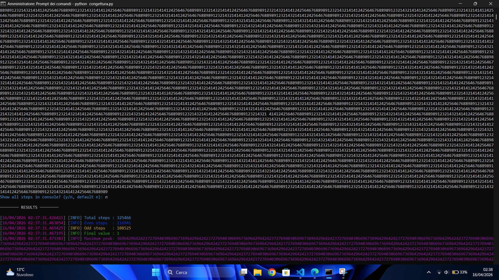
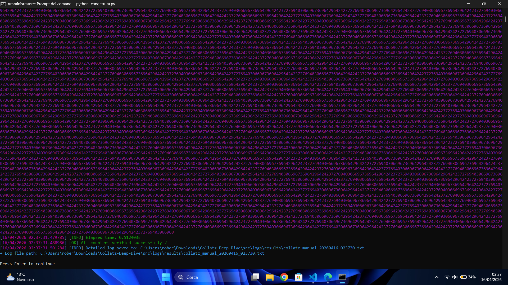

# Collatz-Deep-Dive
Advanced Collatz's conjecture toolkit with power-of-2 validation, negative cycle detection and comprehensive logging. Built for performance and analysis.

# Collatz-Conjecture explained
So what is Collatz's conjecture? This conjecture affirms that if we take a integer number odd/even, if odd we have to multiply by 3 and then add +1 else we have to divide by 2 (3x + 1 | x / 2). As we know, with every number we have used, the output will always be 4-2-1, creating a loop, because 4 / 2 will result in 2; 2 / 2 will result in 1 and 1 x 3 + 1 will result in 4, so it's a loop. We have tested all numbers between 1 and 2 up to the power of 68, but with this tool you can try almost every number, even big numbers, I have tried a very large number 123214321414124256467688989123214321414124256467688989123214321414124256467688989123214321414124256467688989123214321414124256467688989123214321414124256467688989123214321414124256467688989123214321414124256467688989123214321414124256467688989123214321414124256467688989123214321414124256467688989123214321414124256467688989123214321414124256467688989123214321414124256467688989123214321414124256467688989123214321414124256467688989123214321414124256467688989123214321414124256467688989123214321414124256467688989123214321414124256467688989123214321414124256467688989123214321414124256467688989123214321414124256467688989123214321414124256467688989123214321414124256467688989123214321414124256467688989123214321414124256467688989123214321414124256467688989123214321414124256467688989123214321414124256467688989123214321414124256467688989123214321414124256467688989123214321414124256467688989123214321414124256467688989123214321414124256467688989123214321414124256467688989123214321414124256467688989123214321414124256467688989123214321414124256467688989123214321414124256467688989123214321414124256467688989123214321414124256467688989123214321414124256467688989123214321414124256467688989123214321414124256467688989123214321414124256467688989123214321414124256467688989123214321414124256467688989123214321414124256467688989123214321414124256467688989123214321414124256467688989123214321414124256467688989123214321414124256467688989123214321414124256467688989123214321414124256467688989123214321414124256467688989123214321414124256467688989123214321414124256467688989123214321414124256467688989123214321414124256467688989123214321414124256467688989123214321414124256467688989123214321414124256467688989123214321414124256467688989123214321414124256467688989123214321414124256467688989123214321414124256467688989123214321414124256467688989123214321414124256467688989123214321414124256467688989123214321414124256467688989123214321414124256467688989123214321414124256467688989123214321414124256467688989123214321414124256467688989123214321414124256467688989123214321414124256467688989123214321414124256467688989123214321414124256467688989123214321414124256467688989123214321414124256467688989123214321414124256467688989123214321414124256467688989123214321414124256467688989123214321414124256467688989123214321414124256467688989123214321414124256467688989123214321414124256467688989123214321414124256467688989123214321414124256467688989123214321414124256467688989123214321414124256467688989123214321414124256467688989123214321414124256467688989123214321414124256467688989123214321414124256467688989123214321414124256467688989123214321414124256467688989123214321414124256467688989123214321414124256467688989123214321414124256467688989123214321414124256467688989123214321414124256467688989123214321414124256467688989123214321414124256467688989123214321414124256467688989123214321414124256467688989123214321414124256467688989123214321414124256467688989123214321414124256467688989123214321414124256467688989123214321414124256467688989123214321414124256467688989123214321414124256467688989123214321414124256467688989123214321414124256467688989123214321414124256467688989123214321414124256467688989123214321414124256467688989123214321414124256467688989123214321414124256467688989123214321414124256467688989123214321414124256467688989123214321414124256467688989123214321414124256467688989123214321414124256467688989123214321414124256467688989123214321414124256467688989123214321414124256467688989123214321414124256467688989123214321414124256467688989123214321414124256467688989123214321414124256467688989123214321414124256467688989123214321414124256467688989123214321414124256467688989123214321414124256467688989123214321414124256467688989123214321414124256467688989123214321414124256467688989123214321414124256467688989123214321414124256467688989123214321414124256467688989123214321414124256467688989123214321414124256467688989123214321414124256467688989123214321414124256467688989123214321414124256467688989123214321414124256467688989123214321414124256467688989123214321414124256467688989123214321414124256467688989123214321414124256467688989123214321414124256467688989123214321414124256467688989123214321414124256467688989123214321414124256467688989123214321414124256467688989123214321414124256467688989123214321414124256467688989123214321414124256467688989123214321414124256467688989123214321414124256467688989123214321414124256467688989123214321414124256467688989123214321414124256467688989123214321414124256467688989123214321414124256467688989123214321414124256467688989123214321414124256467688989123214321414124256467688989123214321414124256467688989123214321414124256467688989123214321414124256467688989123214321414124256467688989123214321414124256467688989123214321414124256467688989123214321414124256467688989123214321414124256467688989123214321414124256467688989123214321414124256467688989123214321414124256467688989123214321414124256467688989123214321414124256467688989123214321414124256467688989123214321414124256467688989123214321414124256467688989123214321414124256467688989123214321414124256467688989123214321414124256467688989123214321414124256467688989123214321414124256467688989123214321414124256467688989123214321414124256467688989123214321414124256467688989123214321414124256467688989123214321414124256467688989123214321414124256467688989123214321414124256467688989123214321414124256467688989123214321414124256467688989123214321414124256467688989123214321414124256467688989123214321414124256467688989123214321414124256467688989123214321414124256467688989123214321414124256467688989123214321414124256467688989123214321414124256467688989123214321414124256467688989123214321414124256467688989123214321414124256467688989123214321414124256467688989123214321414124256467688989123214321414124256467688989123214321414124256467688989123214321414124256467688989123214321414124256467688989123214321414124256467688989123214321414124256467688989123214321414124256467688989123214321414124256467688989123214321414124256467688989123214321414124256467688989123214321414124256467688989123214321414124256467688989123214321414124256467688989123214321414124256467688989123214321414124256467688989123214321414124256467688989123214321414124256467688989123214321414124256467688989123214321414124256467688989123214321414124256467688989123214321414124256467688989123214321414124256467688989123214321414124256467688989123214321414124256467688989123214321414124256467688989123214321414124256467688989123214321414124256467688989123214321414124256467688989123214321414124256467688989123214321414124256467688989123214321414124256467688989123214321414124256467688989123214321414124256467688989123214321414124256467688989123214321414124256467688989123214321414124256467688989123214321414124256467688989123214321414124256467688989123214321414124256467688989123214321414124256467688989123214321414124256467688989123214321414124256467688989123214321414124256467688989123214321414124256467688989123214321414124256467688989123214321414124256467688989123214321414124256467688989123214321414124256467688989123214321414124256467688989123214321414124256467688989123214321414124256467688989123214321414124256467688989123214321414124256467688989123214321414124256467688989123214321414124256467688989123214321414124256467688989123214321414124256467688989123214321414124256467688989123214321414124256467688989123214321414124256467688989123214321414124256467688989123214321414124256467688989123214321414124256467688989123214321414124256467688989123214321414124256467688989123214321414124256467688989123214321414124256467688989123214321414124256467688989123214321414124256467688989123214321414124256467688989123214321414124256467688989123214321414124256467688989123214321414124256467688989123214321414124256467688989123214321414124256467688989123214321414124256467688989123214321414124256467688989123214321414124256467688989123214321414124256467688989123214321414124256467688989123214321414124256467688989123214321414124256467688989123214321414124256467688989123214321414124256467688989123214321414124256467688989123214321414124256467688989123214321414124256467688989123214321414124256467688989123214321414124256467688989123214321414124256467688989123214321414124256467688989123214321414124256467688989123214321414124256467688989123214321414124256467688989123214321414124256467688989123214321414124256467688989123214321414124256467688989123214321414124256467688989123214321414124256467688989123214321414124256467688989123214321414124256467688989123214321414124256467688989123214321414124256467688989123214321414124256467688989123214321414124256467688989123214321414124256467688989123214321414124256467688989123214321414124256467688989123214321414124256467688989123214321414124256467688989123214321414124256467688989123214321414124256467688989123214321414124256467688989123214321414124256467688989123214321414124256467688989123214321414124256467688989123214321414124256467688989123214321414124256467688989123214321414124256467688989123214321414124256467688989123214321414124256467688989123214321414124256467688989123214321414124256467688989123214321414124256467688989123214321414124256467688989123214321414124256467688989123214321414124256467688989123214321414124256467688989123214321414124256467688989123214321414124256467688989123214321414124256467688989123214321414124256467688989123214321414124256467688989123214321414124256467688989123214321414124256467688989123214321414124256467688989123214321414124256467688989123214321414124256467688989123214321414124256467688989123214321414124256467688989123214321414124256467688989123214321414124256467688989123214321414124256467688989123214321414124256467688989123214321414124256467688989123214321414124256467688989123214321414124256467688989123214321414124256467688989123214321414124256467688989123214321414124256467688989123214321414124256467688989123214321414124256467688989123214321414124256467688989123214321414124256467688989123214321414124256467688989123214321414124256467688989123214321414124256467688989123214321414124256467688989123214321414124256467688989123214321414124256467688989123214321414124256467688989123214321414124256467688989123214321414124256467688989123214321414124256467688989123214321414124256467688989123214321414124256467688989123214321414124256467688989123214321414124256467688989123214321414124256467688989123214321414124256467688989123214321414124256467688989123214321414124256467688989123214321 414124256467688989123214321414124256467688989123214321414124256467688989123214321414124256467688989123214321414124256467688989123214321414124256467688989123214321414124256467688989123214321414124256467688989123214321414124256467688989123214321414124256467688989123214321414124256467688989123214321414124256467688989123214321414124256467688989123214321414124256467688989123214321414124256467688989123214321414124256467688989123214321414124256467688989123214321414124256467688989123214321414124256467688989123214321414124256467688989123214321414124256467688989123214321414124256467688989123214321414124256467688989123214321414124256467688989123214321414124256467688989123214321414124256467688989123214321414124256467688989123214321414124256467688989123214321414124256467688989123214321414124256467688989123214321414124256467688989123214321414124256467688989123214321414124256467688989123214321414124256467688989123214321414124256467688989123214321414124256467688989123214321414124256467688989123214321414124256467688989123214321414124256467688989123214321414124256467688989123214321414124256467688989123214321414124256467688989123214321414124256467688989123214321414124256467688989123214321414124256467688989123214321414124256467688989123214321414124256467688989123214321414124256467688989123214321414124256467688989123214321414124256467688989123214321414124256467688989123214321414124256467688989123214321414124256467688989123214321414124256467688989123214321414124256467688989123214321414124256467688989123214321414124256467688989123214321414124256467688989123214321414124256467688989123214321414124256467688989123214321414124256467688989123214321414124256467688989123214321414124256467688989123214321414124256467688989123214321414124256467688989123214321414124256467688989123214321414124256467688989123214321414124256467688989123214321414124256467688989123214321414124256467688989123214321414124256467688989123214321414124256467688989123214321414124256467688989123214321414124256467688989123214321414124256467688989123214321414124256467688989123214321414124256467688989123214321414124256467688989123214321414124256467688989123214321414124256467688989123214321414124256467688989123214321414124256467688989123214321414124256467688989123214321414124256467688989123214321414124256467688989123214321414124256467688989123214321414124256467688989123214321414124256467688989123214321414124256467688989123214321414124256467688989123214321414124256467688989123214321414124256467688989123214321414124256467688989123214321414124256467688989123214321414124256467688989123214321414124256467688989123214321414124256467688989123214321414124256467688989123214321414124256467688989123214321414124256467688989123214321414124256467688989123214321414124256467688989123214321414124256467688989123214321414124256467688989123214321414124256467688989123214321414124256467688989123214321414124256467688989123214321414124256467688989123214321414124256467688989123214321414124256467688989123214321414124256467688989123214321414124256467688989123214321414124256467688989123214321414124256467688989123214321414124256467688989 and the program returned to me these final numbers, the famous 4-2-1. 

The conjecture has 3 rules:
1. The number must be an integer
2. If odd use 3x + 1, if even use x / 2
3. It functions only in positive numbers, as we have already seen.

# Collatz-Conjecture with negative numbers
The third rule says that the conjecture functions only with positive numbers.. but what happens if WE try with negative? In this tool I created a function dedicated to negative numbers, I have already tested it and it works. Let's take -7 as an example to understand how it functions:
-7x3 + 1 = -20
-20 / 2 = -10
-10 / 2 = -5
-5x3 + 1 = -14
-14 / 2 = -7

You can see it actually creates a loop, so the third rule is right. We have proven that if we use this conjecture on negative numbers, we can obtain loops, like 4-2-1 but this time with the numbers we started, and not the famous 4-2-1. Obviously this "thing" doesn't actually happen in every negative number, if we take -3 it will go like this:
-3x3 + 1 = -8
-8 / 2 = -4
-4 / 2 = -2
-2 / 2 = -1
-1x3 + 1 = -4

In this case we have the famous 4-2-1 loop but in negative, simply. In negative numbers sometimes we can find a loop of the original number, and in other not. Why does this happen? I'm studying this conjecture (even if I'm 16 y.o) because it's simple but at the same time unpredictable, if we see the disposition of numbers is casual, we can go from low to high in one operation. Some days ago I asked myself this, what happens if instead of using 3x + 1 we use 3x - 1 in positive numbers? What we have seen in negative numbers it happens in positive numbers, for example:
7x3 -1 = 20
20 / 2 = 10
10 / 2 = 5
5x3 - 1 = 14
14 / 2 = 7

So my question for everyone is. Is it possible to define a unified version of Collatz function that captures both the behavior of the standard 3x + 1 problem (on positive numbers) and its variations (such as 3x - 1 on negative numbers), and analyze whether they share common attractors or structural patterns?

# How to start the program
First, you need to install Python 3.9 or a later version from [https://www.python.org/](https://www.python.org/). After installing Python, restart your computer to ensure all changes are applied correctly. Once the system has restarted, open the Command Prompt (on Windows) or a terminal, then install the required dependencies by navigating to the project folder. Go to `C:\Users\yourname\Downloads\Collatz-Deep-Dive\other` and run the command `pip install -r requirements.txt` to install all the libraries needed to execute the program.

After that, navigate to the main source folder by typing `cd C:\Users\yourname\Downloads\Collatz-Deep-Dive\src` in the Command Prompt. Once inside the directory, run the program using `python congettura.py` or, if Python is configured differently on your system, `py congettura.py`.

On macOS and Linux, the process is similar but uses the Terminal instead of Command Prompt. First, install Python 3.9 or later from [https://www.python.org/](https://www.python.org/) or via your system package manager, then restart your machine if required. Open the Terminal and move into the `other` directory inside the project folder, for example by running `cd ~/Downloads/Collatz-Deep-Dive/other`, then install the dependencies with `pip3 install -r requirements.txt`. After the installation is complete, navigate to the source directory using `cd ~/Downloads/Collatz-Deep-Dive/src` and run the program with `python3 congettura.py`.

# Who am I?
My online name is importsyss, I'm a Discord bot developer, turning 16 soon and a passionate about math, computer science and physics. My goals are to learn AI (ML, DL etc..) and become an AI engineer for some company and obviously solve math problems. I'm not an intelligent person or whatever, I only want to discover new math problems and resolve them. If you want a Discord bot contact me on Discord @importsyss.
PS: I used DeepSeek and ChatGPT to help me write part of the code, but all the ideas and the overall design are my own. Also, since I'm from Italy and I'm still learning English, I used them to fix my grammar and improve the text.

# Proofs
Here are some photos about the result of the number i mentioned up in this README.md

